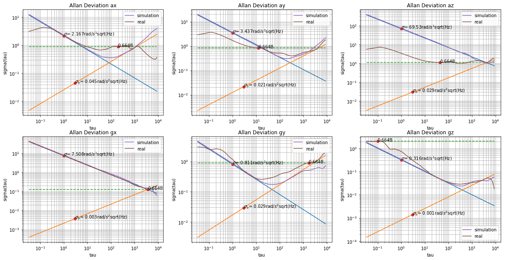

Allan Variance
==================

`Statistics of Atomic Frequency Standards <http://tf.nist.gov/general/pdf/7.pdf>`_ by David W.Allan.

1. Pre-request
-------------------------

**Fourier Transform of Constant function** (for an example x(t) = N):

.. math::
  \begin{align}
  \mathbf{FT}(N) &= \int_{-\infty}^{\infty}N e^{-2\pi i ft}dt \\
  &= \int_{-\infty}^{\infty}N (cos(2\pi ft)-isin(2\pi ft))dt\\
  &= N\int_{-\infty}^{\infty}cos(2\pi ft)dt \\
  &= N\delta(f)
  \end{align}

The cos function is an oscillation, so if f is not zero, the upper integration will be zero.
If we take the inverse fourier transform of Delta function, we will get constant.

2. Power Spectral Density
-------------------------

**Definition** Power Spectral Density (PSD) of a time series x(t) describes the distribution of power into frequency components
composing that signal.

.. math::
  \hat{x}(f) = \int_{-\infty}^{\infty}e^{-2\pi i ft}x(t)dt

.. math::
  PSD_{x}(f) = S_{x}(f) = \mid \hat{x}(f) \mid^{2}

It represent the squared norm of the fourier transform (which represents the freqency space), it will reflect a distribution of the
magnitude of frequence. And we can further derivate the expression:

.. math::
  \begin{align}
  S_{x}(f) &= \int_{t_{1}=-\infty}^{\infty}e^{-2\pi i ft_{1}}x(t_{1})dt_{1}\int_{t_{2}=-\infty}^{\infty}e^{2\pi i ft_{2}}x(t_{2})dt_{2}\\
  &= \int_{t_{1}=-\infty}^{\infty}\int_{t_{2}=-\infty}^{\infty}e^{-2\pi i f(t_{1}-t_{2})}x(t_{1})x(t_{2})dt_{1}dt_{2}
  \end{align}

**Special functions**, for some functions, their fourier transformation may not formlly exist. So we will work with a truncated
fourier transformation in an interval [0,T] (or [-N, N]) to get the formule of Power Spectral Density :

.. math::
  \begin{align}
  \hat{x}(f) &= \frac{1}{\sqrt{T}}\sum_{0}^{T}x(t)e^{-ift} \\
  &= \frac{1}{\sqrt{2N+1}}\sum_{-N}^{N}x(t)e^{-ift}
  \end{align}

.. math::
  S_{x}(f) = \lim_{T\to \infty}\mathbf{E}[\mid \hat{x}(f)\mid^{2}]

3. Wiener-Khirchin Theorem
--------------------------

**Wiener-Khirchin Theorem** For a well behaveral stationary random process the power spectrum is equal to the fourier transform of
the autocorrelation function, i.e. :

.. math::
  S_{x}(f) = \sum_{t= -\infty}^{\infty}R_{xx}(t)e^{-ift}

**Proof**:

.. math::
  \begin{align}
  S_{x}(f) &= \lim_{N\to \infty}\mathbf{E}[\mid \hat{x}(f)\mid^{2}] \\
  &= \lim_{N\to \infty}\frac{1}{2N+1}\mathbf{E}[\sum_{t_{1}=-N}^{N}\sum_{t_{2}=-N}^{N}x(t_{1})x(t_{2})e^{-if(t_{1}-t_{2})} ]\\
  &= \lim_{N\to \infty}\frac{1}{2N+1}\sum_{t_{1}=-N}^{N}\sum_{t_{2}=-N}^{N}\mathbf{E}[x(t_{1})x(t_{2})]e^{-if(t_{1}-t_{2})}
  \end{align}

With definition of R:

.. math::
  \begin{align}
  \mathbf{E}[x(t_{1})x(t_{2})] &= <x(t_{1}), x(t_{2})>\\
  &= <x(t_{2} + (t_{1} - t_{2})), x(t_{2})> \\
  &= R_{xx}(t_{1} - t_{2})
  \end{align}

Apply the upper expression:

.. math::
  \begin{align}
  S_{x}(f) &= \lim_{N\to \infty}\frac{1}{2N+1}\sum_{t_{1}=-N}^{N}\sum_{t_{2}=-N}^{N}R_{xx}(t_{1} - t_{2})e^{-if(t_{1}-t_{2})} \\
  &= \lim_{N\to \infty}\frac{1}{2N+1}\sum_{t_{1}=-N}^{N} \lim_{M\to \infty}\sum_{t_{2}=-M}^{M}R_{xx}(t_{1} - t_{2})e^{-if(t_{1}-t_{2})} \\
  &= \lim_{N\to \infty}\frac{1}{2N+1}(\sum_{t_{1}=-N}^{N}) \sum_{k=-\infty}^{\infty}R_{xx}(k)e^{-ifk} \\
  &= \sum_{k=-\infty}^{\infty}R_{xx}(k)e^{-ifk}
  \end{align}

4. White Noise
-----------------------
Consider random white noise :math:`\xi(t)` with magnitude N, with two-correlation function :

.. math::
  <\xi(t_{1}), \xi(t_{2})> = N^{2}\delta(t_{1} - t_{2})

Applying Wiener-Khintchine theorem:

.. math::
  S_{\xi}(f) = \mathbf{FT}[R_{\xi\xi}(t)] = \int e^{2\pi i ft}N^{2}<\xi(t), \xi(0)>dt = N^{2}

5. Brownian Noise
-----------------

.. math::
  W(t) = \int_{0}^{t}K\xi(t)dt

Mean and covariance could be seen here : `Mean and Covariance of Wiener Process <https://math.stackexchange.com/questions/568391/mean-and-covariance-of-wiener-process>`_

.. math::
  \mathbf{E}[W(t)] = 0

.. math::
  Var(W) = \mathbf{E}[(W(t) - \mathbf{E}[W(t)])^{2}] = \mathbf{E}[(W(t)^{2}] = K^{2}t

.. math::
  <W(t_{1}), W(t_{2})> = min(t_{1}, t_{2})

And the derivative of PSD could be found in this post : `Power Spectral Density of Brownian motion despite non-stationary <https://dsp.stackexchange.com/questions/45574/power-spectral-density-of-brownian-motion-despite-non-stationary>`_

.. math::
  S_{W(t)}(f) = (\frac{K}{2\pi})^2\frac{1}{f^2}

6. Flicker Noise
------------------

7. Implementation
---------------------

`My Implementation Python <https://github.com/gggliuye/VINS_PI/blob/main/IMU/IMU_Allan_Calibration.ipynb>`_

