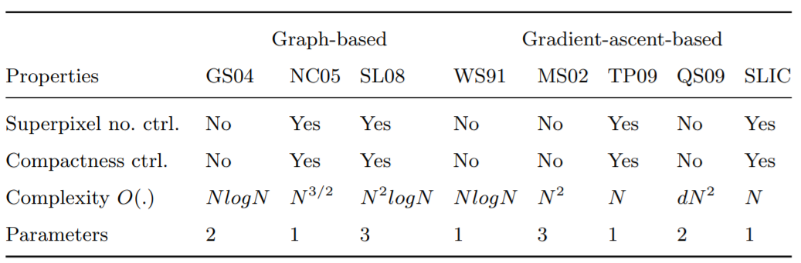

Gardient Ascent
==================

Starting from an inital rough clustering, during each iteration gradient ascnet mehtods refine
the clusters from the previous iteration to obatin better segmentation until convergence.

1. SLIC
-------------------

**SLIC (Simple Linear Iterative Clustering)** (2010) :
This algorithm generates superpixels by clustering pixels based on their color similarity and
proximity in the image plane. This is done in the five-dimensional 'labxy' space, where 'lab'
is the pixel color vector in CIELAB color space and xy is the pixel position.

This `paper <https://www.iro.umontreal.ca/~mignotte/IFT6150/Articles/SLIC_Superpixels.pdf>`_ made a comparsion of different super pixel methods.

1.1 Distance Measure
~~~~~~~~~~~~~~~~~~~~~~~~

.. math::
  d_{lab} = \| v_{lab,1} - v_{lab,2} \|_{2}

.. math::
  d_{xy} = \| v_{xy,1} - v_{xy,2} \|_{2}

.. math::
  D_{s} = d_{lab} + m \frac{d_{xy}}{\sqrt{N/K}}
