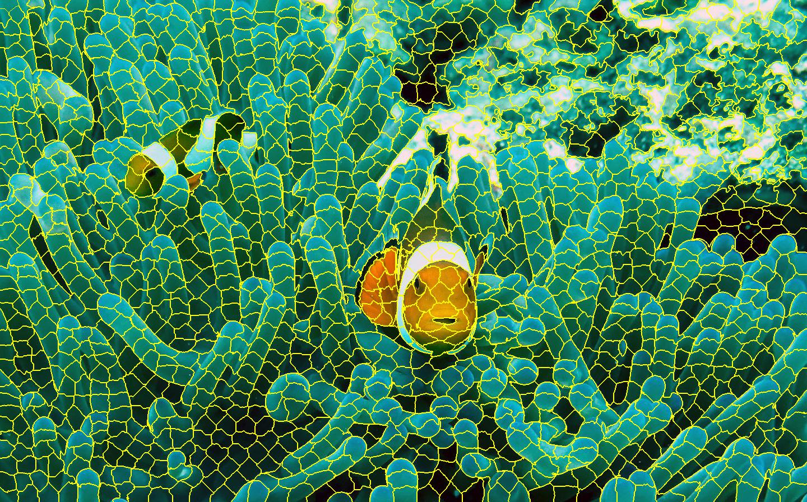

SuperPixel
===================================

`medium post <https://medium.com/@darshita1405/superpixels-and-slic-6b2d8a6e4f08>`_ :

* They carry more information than pixels.
* Superpixels have a perceptual meaning since pixels belonging to a given superpixel share similar visual properties.
* They provide a convenient and compact representation of images that can be very useful for computationally demanding problems.

We normally realize SLAM using points, lines or faces. While, if show a real person an world full of feature points only, he
cannot really understand it without time for hard understand.

While, if any one see the image below (with superpixel), he understand it almost instantly without any diffculty.

* TUC
[Superpixel Technische Universitat Chemnitz](https://www.tu-chemnitz.de/etit/proaut/en/research/superpixel.html) 2015.
[Application](https://www.tu-chemnitz.de/etit/proaut/en/research/changeprediction.html) in a winter-summer localization task.

* SEEDS
[SEEDS: Superpixels Extracted via Energy-Driven Sampling](https://arxiv.org/abs/1309.3848).

.. toctree::
   :maxdepth: 3
   :caption: Contents:

   GraphBased
   GardientAscent
