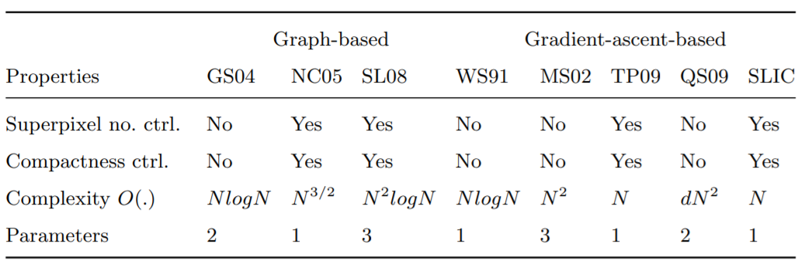
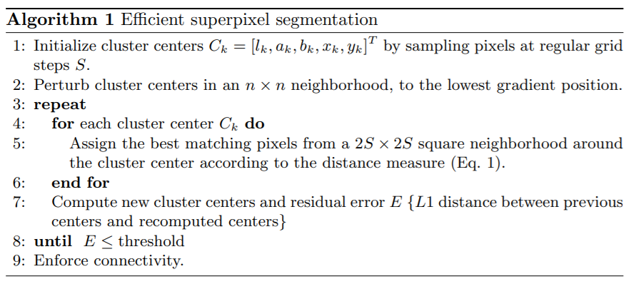

Move boundaries
==================

Gardient Ascent : Starting from an inital rough clustering, during each iteration gradient ascnet methods refine
the clusters from the previous iteration to obatin better segmentation until convergence.

1. SLIC
-----------------

**SLIC (Simple Linear Iterative Clustering)** (2010) :
This algorithm generates superpixels by clustering pixels based on their color similarity and
proximity in the image plane. This is done in the five-dimensional 'labxy' space, where 'lab'
is the pixel color vector in CIELAB color space and xy is the pixel position.

This `paper <https://www.iro.umontreal.ca/~mignotte/IFT6150/Articles/SLIC_Superpixels.pdf>`_ made a comparsion of different super pixel methods.

* `Fast implementation <https://github.com/Algy/fast-slic>`_ , with `paper <https://github.com/Algy/fast-slic/files/4009304/fastslic.pdf>`_ , offers a C++ version with lots of hardware acceleration.
* `Simple python implementation <https://github.com/laixintao/slic-python-implementation>`_ for better understand the algorithm.

1.1 Distance Measure
~~~~~~~~~~~~~~~~~~

.. math::
  \begin{align*}
  &d_{lab} = \| v_{lab,1} - v_{lab,2} \|_{2} \\
  &d_{xy} = \| v_{xy,1} - v_{xy,2} \|_{2} \\
  &D_{s} = d_{lab} + m \frac{d_{xy}}{\sqrt{N/K}}
  \end{align*}

where N is the number of pixels in the image, and K the number of desired clusters. The N K term serves as a normalization for pixel distance.

1.2 Algorithm
~~~~~~~~~~~~~~~~~~

Image gardient computed as :

.. math::
  G(x,y) = \|I(x+1, y) - I(x-1,y)\|^{2} + \|I(x, y+1) - I(x,y-1)\|^{2}

While this gradients' calculation are only used in the initialization stage, for getting a better initial superpixel center.

The algorithm is a sepcial case of K-means adapted to the task.

2. SEEDS
---------------------

`SEEDS: Superpixels Extracted via Energy-Driven Sampling <https://arxiv.org/abs/1309.3848>`_ refine a
initial segments by iteratively exchanging pixels between neighboring superpixels.
`revised <https://davidstutz.de/efficient-high-quality-superpixels-seeds-revised/>`_ .
See more about it implementation in the next chapter.
